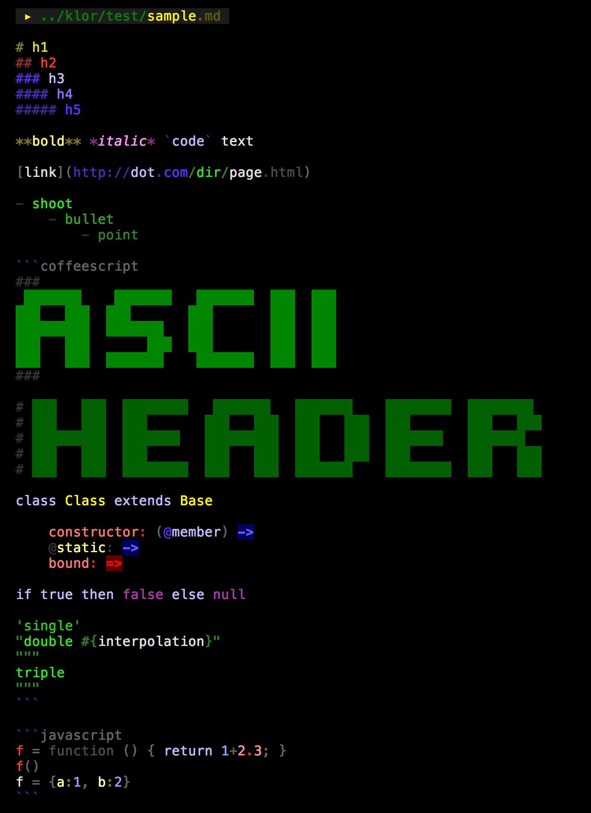

**klor** is a simple syntax highlighting tool.
It exports the following function:

### **blocks** *lines*, *ext*

- *lines*: array of strings
- *ext*: file type
    - coffee js ts 
    - styl css sass
    - pug html svg 
    - bash fish sh 
    - cpp hpp c h 
    - noon json
    - md plist 
    
**returns** an array of objects:

```coffeescript
[
    ext:    string              
    chars:  number              
    index:  number              
    number: index+1 
    chunks: [
                match:  string  # without whitespace characters
                value:  string  # description of match
                turd:   string  # following punctuation characters
                start:  number  # character index of match in line
                length: number  # length of match
            ]
...
]
```

See [kolor.map](https://github.com/monsterkodi/klor/blob/master/coffee/kolor.coffee) for a list of recognized chunk values.

## 🌈 kolor

**kolor** is a submodule which exports a bunch of functions for wrapping strings in 256 color ansi codes.

It's a merge of [colorette](https://github.com/jorgebucaran/colorette) and [ansi-256-colors](https://github.com/jbnicolai/ansi-256-colors)

- [r g b c m y w][1..8] foreground colors 
- [R G B C M Y W][1..8] background colors
    
```coffeescript
klor = require 'klor'
klor.kolor.globalize() # hoist color functions into the global scope
log y8 'bright yellow' + R1 'on dark red'
```
